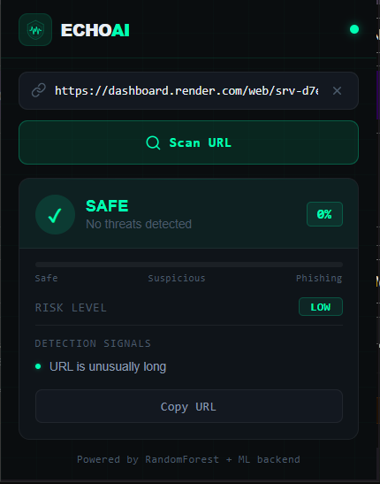
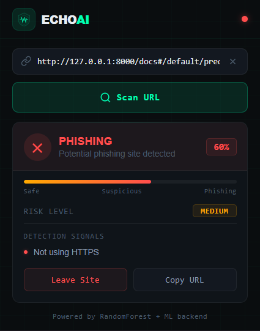
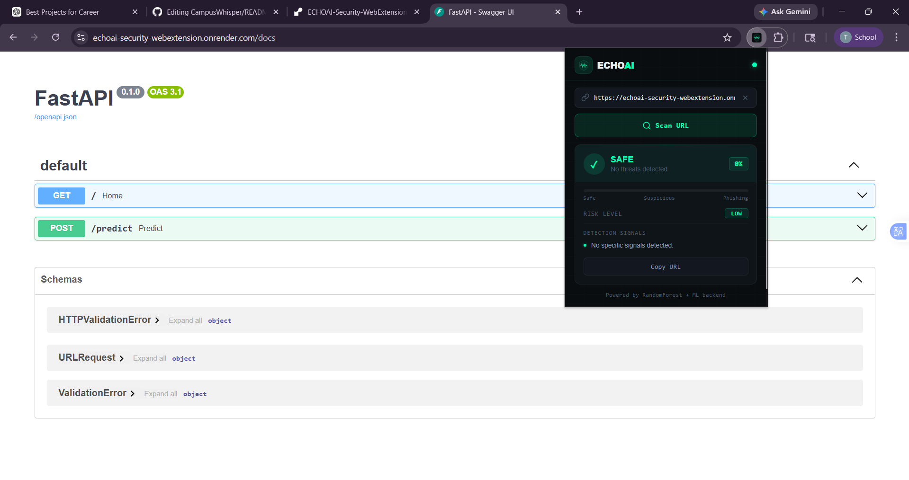

<div align="center">


# Echo AI Security

**AI-powered phishing detection, right in your browser.**

[](https://chrome.google.com/webstore)
[](https://fastapi.tiangolo.com)
[](https://python.org)
[](./LICENSE)

</div>

---

## Overview

Echo AI Security is a Chrome extension that detects phishing websites in real-time using a machine learning backend. It analyzes URLs on the fly, scores their risk level, and delivers clear visual warnings before users interact with dangerous sites — all without storing any personal data.

---

## Features

|     | Feature             | Description                                 |
| --- | ------------------- | ------------------------------------------- |
| 🔍  | Real-time detection | Scans URLs instantly on click               |
| 🧠  | ML-powered          | Random Forest model trained on URL features |
| 📊  | Confidence scoring  | Shows exact phishing probability            |
| 🎯  | Explainable AI      | Tells you _why_ a URL was flagged           |
| 🚨  | Warning overlay     | Full-page block on high-risk sites          |
| 🎨  | Modern UI           | Dashboard-style popup with risk meter       |
| 🔒  | Privacy-first       | No data stored, no tracking                 |

---

## Screenshots

### Safe Website Detection



### Phishing Website Detection



### Full Page View

## 

## How It Works

```
User visits URL
      │
      ▼
Extension sends URL → FastAPI backend
      │
      ▼
Feature extractor analyzes:
  • URL length          • HTTPS presence
  • Suspicious keywords • Special characters
  • Domain structure    • Subdomain count
      │
      ▼
Random Forest model → phishing probability
      │
      ▼
AI agent assigns:
  • Risk level  (Low / Medium / High)
  • Action      (Allow / Warn / Block)
      │
      ▼
Extension displays result + explanation
```

---

## Tech Stack

### Chrome Extension

- HTML · CSS · JavaScript
- Chrome Extension APIs (Manifest V3)

### Backend

- **FastAPI** — REST API server
- **Scikit-learn** — Random Forest classifier
- **Pandas / NumPy** — Feature engineering
- **Uvicorn** — ASGI server

### ML Pipeline

- URL-based feature extraction (16+ features)
- Probability-based classification
- Rule-based enhancement layer for edge cases

---

## Installation

### Prerequisites

- Python 3.10+
- Google Chrome
- Git

---

### 1 — Clone the repository

```bash
git clone https://github.com/your-username/echo-ai-security.git
cd echo-ai-security
```

### 2 — Set up the backend

```bash
cd backend
pip install -r requirements.txt
uvicorn main:app --reload
```

The backend will start at `http://127.0.0.1:8000`.

### 3 — Load the Chrome extension

1. Open Chrome and go to `chrome://extensions/`
2. Enable **Developer Mode** (top-right toggle)
3. Click **Load unpacked**
4. Select the `extension/` folder

The Echo AI icon will appear in your toolbar.

---

## Usage

1. Click the **Echo AI** icon in your Chrome toolbar
2. The current tab's URL is auto-filled
3. Click **Scan URL**
4. View the result:
   - Risk level (Low / Medium / High)
   - Confidence score (0–100%)
   - Detection reasons (what triggered the flag)
5. On high-risk sites, a full-page warning overlay appears with options to leave or proceed

---

## Live Backend

Deployed on Render — swap the URL in `popup.js` to point to your deployment:

```
https://your-backend-url.onrender.com
```

Update `BACKEND` in `popup.js`:

```js
const BACKEND = "https://your-backend-url.onrender.com/predict";
```

---

## Detection Signals

The model evaluates these URL characteristics to determine risk:

| Signal                                            | Risk Indicator     |
| ------------------------------------------------- | ------------------ |
| `login`, `verify`, `secure`, `account` in URL     | High suspicion     |
| Missing HTTPS                                     | Elevated risk      |
| Excessive special characters (`-`, `_`, `=`, `@`) | Suspicious         |
| Unusually long URL                                | Common in phishing |
| IP address instead of domain                      | Strong indicator   |
| High subdomain count                              | Obfuscation tactic |

---

## Privacy & Security

- **No personal data collected** — only the URL text is analyzed
- **No browsing history stored** — each scan is stateless
- **No third-party tracking** — fully self-contained
- **Local backend option** — can run 100% offline on `localhost`

---

## Project Structure

```
echo-ai-security/
├── backend/
│   ├── main.py              # FastAPI app + /predict endpoint
│   ├── model.pkl            # Trained Random Forest model
│   ├── feature_extractor.py # URL feature engineering
│   └── requirements.txt
├── extension/
│   ├── manifest.json
│   ├── popup.html
│   ├── popup.css
│   ├── popup.js
│   ├── content.js
│   ├── background.js
│   └── icons/
│       ├── icon16.png
│       ├── icon48.png
│       └── icon128.png
└── screenshots/
    ├── safe.png
    └── phishing.png
```

---

## 📫 Contact / Support

- For questions, suggestions, or support, please open an issue on the [GitHub repository](https://github.com/Tarun-Chowdary/ECHOAI-Security-WebExtension/issues).
- You can also reach out via email: yegi.2992@gmail.com

---

## 📄 License

This project is open source and available under the [MIT License](LICENSE).

---

<div align="center">

If this project helped you, consider giving it a ⭐ on GitHub — it helps a lot!

**Built with 🔐 and a lot of ☕**

</div>
